# 👋 Hi, I'm Kishan Chouhan

<p align="center">
  
</p>

---

## 👨‍💻 About Me

I'm a passionate **Full Stack Developer** focused on building modern, responsive, and user-friendly web applications.

I enjoy transforming ideas into real-world projects and continuously improving my development skills through hands-on learning and experimentation.

* 🌱 Currently exploring **React.js**
* 💻 Interested in **Full Stack Development**
* 🚀 Building projects to strengthen my development skills
* 🎨 Interested in modern UI/UX and responsive web design
* ☁️ Exploring deployment and cloud technologies
* 📚 Always learning and improving

---

## 🛠️ Tech Stack

### Frontend

<p>
  
</p>

### Backend

<p>
  
</p>

### Database

<p>
  
</p>

### Deployment & Cloud

<p>
  
</p>

---

## 🚀 What I Build

* 🌐 Responsive Websites
* ⚛️ React Applications
* 🟢 Node.js & Express.js Backend Applications
* ☕ Spring Boot Applications
* 🗄️ Database-driven Applications
* 🔐 REST APIs
* 📱 Responsive UI Designs
* ☁️ Deployed Full Stack Applications

---

## 🚀 Featured Projects

### 🏠 Airbnb

A full-stack property rental web application with features for listing, viewing, and managing rental properties.

**Technologies:** Node.js, Express.js, MongoDB, MongoDB Atlas, Cloudinary

---

### 📝 Online Exam Portal

An online examination system designed to manage exams, questions, students, and results.

**Technologies:** Angular, Spring Boot, Java, MySQL

---

### 🚛 Smart Commercial Vehicle & Construction Machinery Rental Platform

A full-stack rental platform designed for managing commercial vehicles and construction machinery, providing users with an efficient way to explore and manage rental services.

**Technologies:** React.js, Spring Boot, MySQL, Maven, Bootstrap

---

## 📊 GitHub Stats

<p align="center">
  
  
</p>

---

## 🔥 GitHub Streak

<p align="center">
  
</p>

---

## 🌐 Connect With Me

<p align="center">
  <a href="https://kishan-portfolio-vc8n.onrender.com">
    
  </a>
  <a href="https://www.linkedin.com/in/kishan-chouhan-2796b233a">
    
  </a>
  <a href="https://github.com/KishanChouhan95">
    
  </a>
  <a href="mailto:kishanchouhanc95@gmail.com">
    
  </a>
</p>

---

## 💡 Current Focus

```text
Frontend Development
        ↓
React.js
        ↓
Full Stack Development
        ↓
REST APIs & Databases
        ↓
Deployment & Cloud
```

---

## ⚡ Development Philosophy

> **Build. Learn. Improve. Repeat.**

I believe the best way to learn development is by building real projects, solving problems, experimenting with new technologies, and continuously improving.

---

<p align="center">
  
</p>

<p align="center">
  <b>Thanks for visiting my profile! 🚀</b>
</p>

