# Hi there, I'm Kishan Chouhan 👋

<picture>
  <source media="(prefers-color-scheme: dark)" srcset="dark.svg">
  <source media="(prefers-color-scheme: light)" srcset="light.svg">
  
</picture>

---

## 🚀 About Me

- 🔭 **Current Focus:** Building scalable full-stack web applications using Node.js, Express.js, React, and Spring Boot.
- 💻 **Frontend:** Crafting fast, dynamic user interfaces with React, Vite, Tailwind CSS, and Bootstrap.
- ⚙️ **Backend:** Designing RESTful APIs, MVC architecture, and server-side logic using Express.js & Spring Boot.
- 🗄️ **Database & Cloud:** Managing databases on MongoDB Atlas & MySQL, and deploying web services on Render.
- 🛠️ **Version Control:** Active workflow using Git and GitHub for project repository management.

---

## 🛠️ Tech Stack & Tools

### **Frontend**

### **Backend & Database**

### **Tools & Deployment**

---

## 🚀 Featured Projects

### 🏠 **Airbnb Clone**
A full-stack property rental web application with features for listing, viewing, and managing rental properties.
- **Technologies:** Node.js, Express.js, MongoDB, MongoDB Atlas, Cloudinary

### 📝 **Online Exam Portal**
An online examination system designed to manage exams, question banks, students, and results.
- **Technologies:** Angular, Spring Boot, Java, MySQL

### 🚛 **Smart Commercial Vehicle & Construction Machinery Rental Platform**
A full-stack rental platform designed for managing commercial vehicles and heavy construction machinery.
- **Technologies:** React.js, Spring Boot, MySQL, Maven, Bootstrap

---

## 📊 GitHub Stats

  
  

   
  

---

## 🌐 Connect With Me

